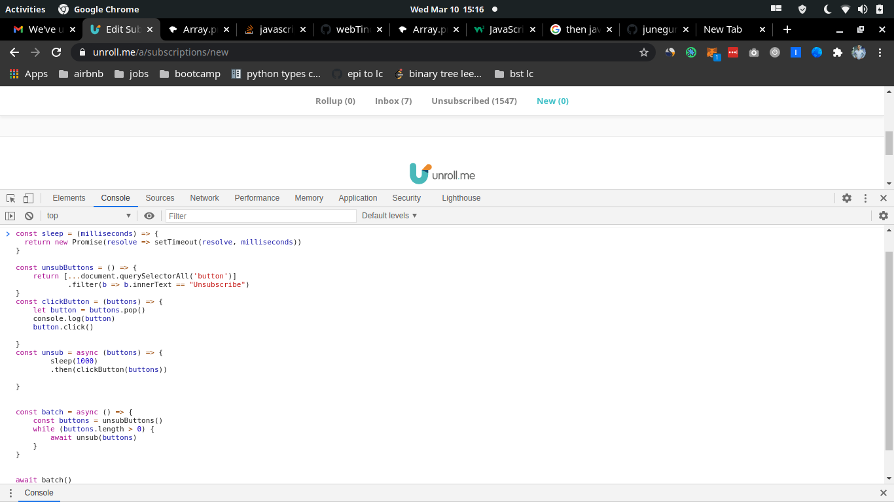

# Summary
For some reason, unroll.me has removed their "Unsubscribe All" button.

This is better than clicking "Unsubscribe" 100s of times.

# How To
- log into [unroll.me](https://unroll.me)
- copy + paste `index.js` contents into console

- continually call `await batch()` (looking for a better way to do this..)
